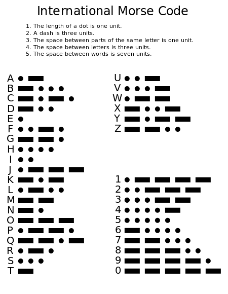

# Morse Code Js

<--bagdes-->

morse-code.js is a mini javascript library that converts a given text to morse code or a given morse code back to text.

The key is based on the table below.

<div style="align-items:center;">
</div>

### Alterations

For a bit of clarity, I

1. I used `*` as dot and `-` as dash
1. Made the dash one unit instead of three
1. I used `.` to seperate the letters and `|` to seperate words.

### Installation

`npm install morse-code`

### Usage

```js
const morseCode = require('morse-code');

morseCode.morse();
morseCode.string();
morseCode.morseSentence();
morseCode.stringSentence();
```

### API

| Method             | Params                                                                           |
| ------------------ | -------------------------------------------------------------------------------- |
| `morse()`          | Takes a `stringText` and converts it to a morse code. Letters seperated by `.`   |
| `string()`         | Takes an existing `morseText` and convert it to a readable string                |
| `morseSentence()`  | Takes a `stringSentence` and converts it to a morse code. Words seperated by `|` |
| `stringSentence()` | Takes a `morseSentence` and converts it to a string sentence                     |

### Author

[Ephraim Atta-Duncan](https://dephraim.now.sh)

### License

[MIT](./license)
